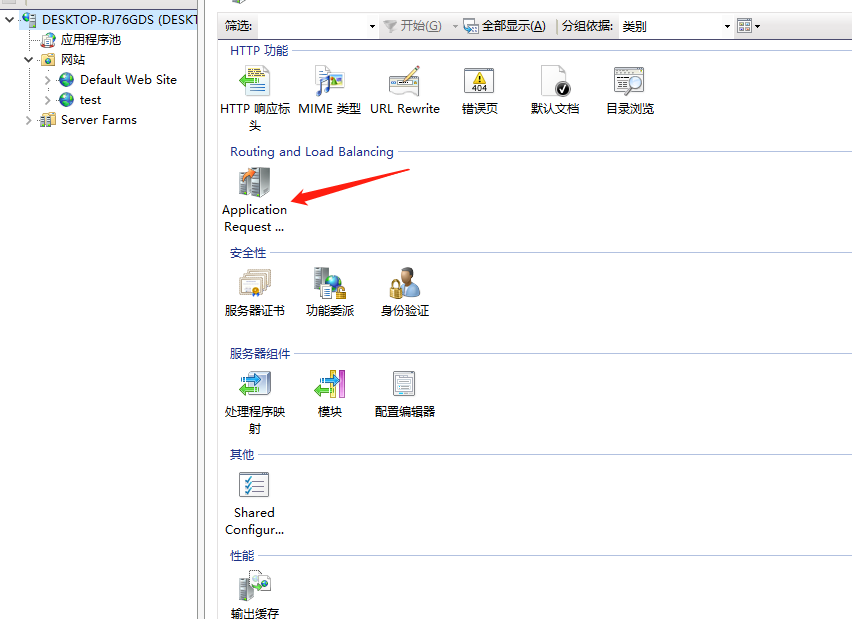
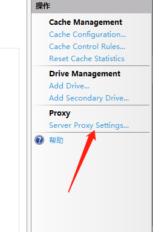
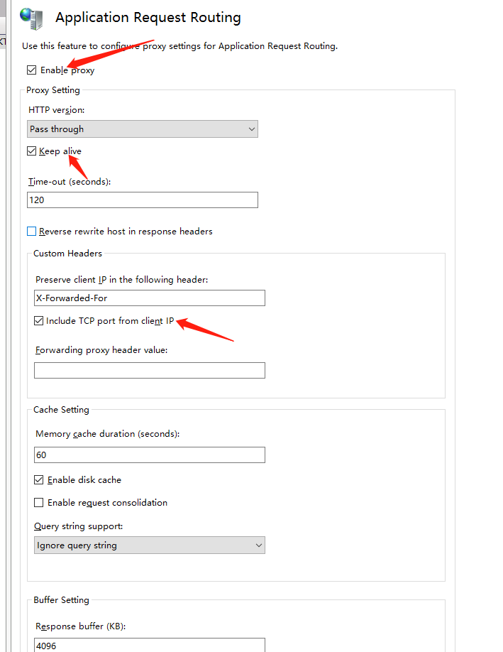
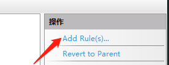
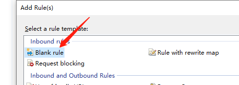
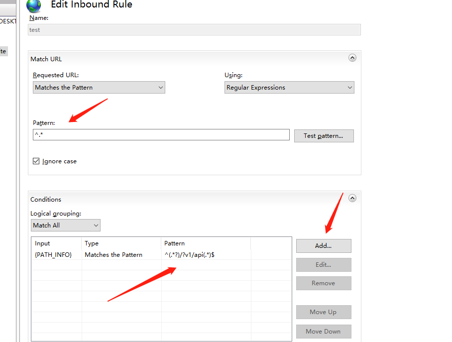

#  IIS

  >使用80端口代理不同的服务
 ##  安装依赖

 [下载地址](https://pan.baidu.com/s/1_T6qMeADdBQoqpfdGc4b5g)   提取码：`tyq8`
 ## 启动代理

 )
 )
 )

  `iisreset`  重启

## 设置代理规则
  )
  )
  )
  )
  )

匹配规则
``` 
^(.*?)/?v1/api(.*)$  

```

代理服务
```
http://localhost:8086/api/{C:2}
```

匹配到`v1/api`之后转发到`8086`端口

如果想请求`8086`的服务可以这么写

```
http://localhost/v1/api/userlist
```